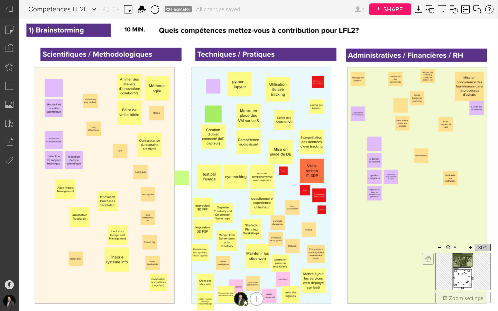

```{r setup, include=FALSE}
knitr::opts_chunk$set(echo = FALSE, include = FALSE)
require(tidyverse)
require(kableExtra)
require(rmarkdown)
#library(rticles)
#render("index.Rmd", output_format = "word_document")
#render("index.Rmd", output_format = "pdf_document")
#render("index.Rmd", output_format = "elsevier_article")
#require(metathis)

#Create myheader.html
# fileConn <- file("metadata.html")
# writeLines('<meta name="robots" content="noindex">', fileConn)
# close(fileConn)

# library(diffr)
# diffr("LF2L-Competences.csv", "Alex.csv")

```


# But de ce document

**Dernière mise à jour du document: `r format(Sys.time(), "%b %d/%Y  %X ")`**

Document en construction pour le bilan de competences du LF2L

Participants

- Mauricio Camargo
- Laurent Dupont
- Ferney Osorio
- Giovanny Arbelaez
- Alex Gabriel
- Benjamin Ennersser-Serville
- Frederick Fontaine
- Fabio Cruz


# Démarche

Les participants cités auparavant qui font partie de l'équipe du Lorraine Fab Living Lab se sont réunis le Mercredi 09/12/2021 afin d'établir un premier bilan de compétences selon trois type principalement:

1. **Compétences Scientifiques / Méthodologiques:** Ils sont définis comme l'aptitude à présenter, à mettre en œuvre et à développer les fondements théoriques, scientifiques et/ou méthodologiques des Domaines et Compétences associées

2. **Compétences Techniques / Pratiques**: Ils sont définis comme l'aptitude à présenter, à mettre en oeuvre et à développer les technologies et/ou pratiques (formation des usagers, mesures de sécurité, …) 


3. **Compétences Administratives / Financières / RH**: Ils sont définis comme l'aptitude à présenter, à mettre en oeuvre et à développer des démarches selon les protocoles établies par la hierarchie correspondant.	


La séance a été comporté par deux moments:

1. Phase de Brainstorming pour identifier les diverses compétences de chaque participant.
2. Phase d'organisation pour les compétences selon le cadre méthodologique du LF2L.


<div style="width: 100%;" class="embed-thumb"> <h1 style="position: relative;vertical-align: middle;display: inline-block; font-size: 24px; line-height:22px; color: #393939;margin-bottom: 10px; font-weight: 300;font-family: Proxima Nova, sans-serif;">  <div style="padding-left:50px"> <span style="max-width:555px;display: inline-block;overflow: hidden; white-space: nowrap;text-overflow: ellipsis;line-height: 1; height: 25px; margin-top: -3px;">Competences LF2L</span> <span style="position:relative;top:-3px;font-size: 16px; margin-top: -6px; line-height: 24px;color: #393939; font-weight: 300;"> by Fabio Cruz</span> </div> </h1> <div style="position: relative; height: 0;overflow: hidden; height: 400px; max-width: 800px; min-width: 320px; border-width: 1px; border-style: solid; border-color: #d8d8d8;"> <div style="position: absolute;top: 0;left: 0;z-index: 10; width: 600px; height: 100%;background: url(https://murally.blob.core.windows.net/thumbnails/afterlf2l3424/murals/afterlf2l3424.1607357569563-5fce548128d9e2ef18d411fa-5fcecac2-f7cb-47fc-9a58-8deea3d7a931.png?v=f3715b27-046c-452c-8848-58ba8d474af3) no-repeat center center; background-size: cover;"> <div style="position: absolute;top: 0;left: 0;z-index: 20;width: 100%; height: 100%;background-color: white;-webkit-filter: opacity(.4);"> </div> <a href="https://app.mural.co/t/afterlf2l3424/m/afterlf2l3424/1607357569563/155fa904e01fcf8f010fcc9a5ada17218f20a810" target="_blank" rel="noopener noreferrer" style="transform: translate(-50%, -50%);top: 50%;left: 50%; position: absolute; z-index: 30; border: none; display: block; height: 50px; background: transparent;">  </a> </div> </div> <p style="margin-top: 10px;margin-bottom: 60px;line-height: 24px; font-size: 16px;font-family: Proxima Nova, sans-serif;font-weight: 400; color: #888888;"> You will be able to edit this mural. </p></div>


## Initial Brainstorming

```{r, include=TRUE, layout="l-page"}


```


# Résultat


```{r Tabla.domaines, include=FALSE}

Domaines <- 
tribble(
  ~Domaine, ~Type, ~Nature, 
 
"Conception projet recherche en Innovation collaborative & territoirial" , "Recherche et Innovation", "Sci",
 "Conception projet recherche en Innovation collaborative & territoirial", "Espaces d'Innovation collaborative", "Sci", 
"Conception projet recherche en Innovation collaborative & territoirial", "Conceptualisation de projects d'Innovation territorial  & Smart City", "Sci",

"Pilotage recherche en Innovation collaborative" , 
 "Recherche et Innovation", "Tech",

"Montage projet recherche en Innovation collaborative",  
 "Recherche et Innovation", "Admin", 


"Créativité et gestion des connaissances", "Créativité", "Sci",
"Créativité et gestion des connaissances", "Créativité", "Admin",
"Créativité et gestion des connaissances", "Créativité", "Tech", 
"Créativité et gestion des connaissances", "Open Innovation", "Sci",
"Créativité et gestion des connaissances", "Open Innovation", "Tech",
"Créativité et gestion des connaissances", "Fiches Idées", "Tech",

"Design et materialization", "Modeles CAO", "Tech",
"Design et materialization", "Prototypage electronique", "Tech", 
"Design et materialization", "Prototypage Mécanique", "Tech", 
"Design et materialization", "Prototypage Objets connectés", "Tech", 

"Fabrication additive", "Impresion 3D Dépôt de fil fondu", "Tech", 
"Fabrication additive", "Impresion 3D Stereolithographie", "Tech", 
"Fabrication additive", "Impresion 3D Composite", "Tech", 


"Veille technologique" ,"Manteinance parc machines", "Admin", 
"Veille technologique", "Veille technologique", "Sci", 
   
"Environnement immersives et Realité virtuelle", "Modeles VR", "Tech", 
"Environnement immersives et Realité virtuelle", "Technologie VR", "Tech", 
"Environnement immersives et Realité virtuelle", "Theorie sur Environment collaboratifs e immersives spaces", "Sci", 


"Evaluation par l'usage", "Living lab", "Sci", 
"Evaluation par l'usage", "Technologies Eye-tracking", "Tech", 
"Evaluation par l'usage", "Questionnaires", "Tech", 
"Evaluation par l'usage", "Capteurs physiologiques", "Tech" ,


"Data management & AI", "Système d'information", "Tech",
"Data management & AI", "Services IaaS", "Tech", 
"Data management & AI", "Théorie des systèmes intelligentes", "Sci", 
"Data management & AI", "Alogritmes d'Apprentissage", "Sci", 
"Data management & AI", "Base de donnés", "Sci", 


"Gestion Administrative et Finanacière", "Pilotage projet EU", "Admin", 
"Gestion Administrative et Finanacière",  "Pilotage projet UL", "Admin", 
"Gestion Administrative et Finanacière", "Achats UL", "Admin", 
"Gestion Administrative et Finanacière",  "RH", "Admin", 
"Gestion Administrative et Finanacière", "Partenariats inter/extra UL", "Admin", 
"Gestion Administrative et Finanacière",  "Gestion de commandes UL", "Admin", 
"Gestion Administrative et Finanacière", "Prestations UL", "Admin", 
"Gestion Administrative et Finanacière",  "Gestion du site LF2L", "Admin", 
"Gestion Administrative et Finanacière", "Lien avec des institutions Intra / Extra UL", "Admin" ,

"Logiciels & outils TIC Recherche", "Github", "Logiciels" ,
"Logiciels & outils TIC Recherche", "Vosviewer", "Logiciels", 
"Logiciels & outils TIC Recherche", "Dévelopement web (Pages Statiques)", "Logiciels", 
"Logiciels & outils TIC Recherche", "Rstudio", "Logiciels", 
"Logiciels & outils TIC Recherche", "Jupyter", "Logiciels", 
"Logiciels & outils TIC Recherche", "Intuiface", "Logiciels", 
"Logiciels & outils TIC Recherche", "Matlab", "Logiciels", 
"Logiciels & outils TIC Recherche", "Nvivo", "Logiciels", 
"Logiciels & outils TIC Recherche", "Onshape", "Logiciels", 
"Logiciels & outils TIC Recherche", "IBM rational rhapsody", "Logiciels",  
"Logiciels & outils TIC Recherche", "IceSL", "Logiciels", 
"Logiciels & outils TIC Recherche", "R", "Langage informatique", 
"Logiciels & outils TIC Recherche", "Python", "Langage informatique", 
"Logiciels & outils TIC Recherche", "Javascript", "Langage informatique", 
"Logiciels & outils TIC Recherche", "PHP", "Langage informatique", 
"Logiciels & outils TIC Recherche", "OWL", "Langage informatique", 
"Logiciels & outils TIC Recherche", "Adobe XD", "Logiciels", 
"Logiciels & outils TIC Recherche", "Unity", "Logiciels", 
"Logiciels & outils TIC Recherche", "Docker", "Logiciels"
)
```


```{r Tabla.competences, include=FALSE}
Competence.LF2L <- 
tribble(
   ~Type, ~Nature, ~Competence, #~Description, 

 # Recherche et Innovation ----

 
"Recherche et Innovation", "Sci",  "Conception des projet de Recherche et développement, d’études et prospective",

"Recherche et Innovation", "Sci", 
   "Développer de nouvelles méthodes quantitatives et qualitatives pour des projets de recherche en Innovation",

"Recherche et Innovation","Tech",
   "Mettre en oeuvre des méthodes quantitatives et qualitatives pour des projets de recherche en Innovation",
   
"Recherche et Innovation","Sci",
   "Réaliser les outils numériques exploitant les nouvelles méthodes",

"Recherche et Innovation", "Tech",
 "Rédiger des rapport scientifiques, techniques pour des parties prenantes des projets",

"Système d'information", "Tech", 
   "Concevoir l'architecture et le fonctionnement du système d'information",
"Système d'information", "Tech", 
   "Gérer la réalisation de système d'information selon la methode agile", 
"Système d'information", "Tech", 
   "Concevoir l'experience utilisateur ( réalisation et evaluation de maquette)",
"Système d'information", "Tech", 
   "Developper des systèmes informatiques en equipe",
"Système d'information", "Tech", 
   "Déployer les developments informatiques sur des serveurs",

"Recherche et Innovation", "Tech", 
   "Faire le point sur l'état de l'art et les limites des savoirs au sein d'un domaine de recherche en Innvoations, aux échelles locale, nationale et internationale",

"Recherche et Innovation", "Admin", 
   "Création et estimation de budget de fonctionement et Investissement pour des projets",

# Creativité ----

"Créativité", "Sci", 
   "Conception des projet de recherche sur la Créativité et géneration des idées" ,
      

"Créativité", "Tech", 
   "Animation d'ateliers de Créativité et Innovation stratégique",

"Créativité", "Tech", 
   "Conception et utilisation des outils support (numeriques et physiques) pour des ateliers de Créativité et Innovation",

"Créativité", "Admin", 
   "Gestion (Achat et renouvellment) des licences de logiciesl pour la créativié",

# Open Innovation ----
"Open Innovation", "Sci", 
   "Developement et implementation des methodologies de Innovation collaborative",

"Open Innovation", "Tech", 
   "Utilisation de méthodes agiles de collaboration pour development projets e workshops",

# Ideas 2D ----
"Modeles CAO", "Tech", 
   "Conception de modèles et prototypes de produit en CAO",
"Fiches Idées", "Tech", 
   "Utilisation des support numeriques pour presentation et slection des idées",

# Digitalization 3D ----

"Services IaaS", "Tech", 
   "Utilisation et deployment de services web IaaS",


# Veille technologique ----

"Veille technologique", "Sci", 
   "Réalisation de la veille technologique sur les avances de procédés de matérialisation et protoypage en open source",

"Manteinance parc machines", "Admin", 
   "Programation et réalisation de mantenance des parc de machines",

# Materialization ----

"Prototypage electronique", "Tech", 
   "Development des prototypes et Objets Intermedaires de Conception (OIC) electroniques",

"Prototypage Mécanique", "Tech", 
   "Development des prototypes et Objets Intermedaires de Conception (OIC) mécaniques",

"Prototypage Objets connectés", "Tech", 
   "Development des prototypes et Objets Intermedaires de Conception (OIC) opén hardware connectés",

# Impresion 3D ----

"Impresion 3D Dépôt de fil fondu", "Tech", 
   "Matrise de procédé d'impression 3D par deposition de filament fondu",

"Impresion 3D Stereolithographie", "Tech", 
   "Matrise de procédé d'impression 3D SLA",

"Impresion 3D Composite", "Tech", 
   "Matrise de procédé d'impression 3D polymer et fibre de reinforcement",

# VR Simulation ----
"Modeles VR", "Tech", 
   "Creation e contenu en VR para prototypos a une échelle produit et territoire",

"Technologie VR", "Tech", 
   "Creation des dispositifs et de modules pour expérimentation VR",


# User evaluation ----

"Living lab", "Sci", 
   "Development de méthodologies et des protocoles d'évaluation de nouvelle produits / filière en model living lab",

"Technologies Eye-tracking", "Tech", 
   "Utilisation et explotation des données issue de technologies Eye-tracking",

"Questionnaires", "Tech", 
   "Development de protocoles et questionnaire pour l'evaluation d'usage",

"Capteurs physiologiques", "Tech", 
   "Utilisation et creation des basse des données explotables par capteurs des capteurs physiologiques",

# ICE ----

"Theorie sur Environment collaboratifs e immersives spaces", "Sci", 
   "Development des protocoles de performance sur les ICE",

# Innovation Labs ----

"Espaces d'Innovation collaborative", "Sci", 
   "Development de méthodes de management ciblés pour les espaces de innovation collaborative et tieurs-lieux",


# Innovation territorial ----

"Conceptualisation de projects d'Innovation territorial  & Smart City", "Sci", 
   "Development de méthodes pour piloter des projets de developpement territorial",


# AI ----

"Théorie des systèmes intelligentes", "Sci", 
   "Utilisation et dévelopment des méthodologies de  modélisation des systèmes multi-agents",

"Alogritmes d'Apprentissage", "Sci", 
   "Dévelopement des algortimes d'apprentisage automatique",

"Base de donnés", "Sci", 
   "Implementation des machines virtuels, basse des donnés et réseau d'information",

# Gestion ----

"Pilotage projet EU", "Admin", 
   "Piloter un 'Work package' dans un projet européen",

"Pilotage projet UL", "Admin", 
   "Pilotage administratif des projet de recherche au sein de l'UL",

"Achats UL", "Admin", 
   "Mise en concurrences des fournisseurs dans les processus d'achat",

"RH", "Admin", 
   "Conduite d'entretiens pour nouvelle personnel",

"Partenariats inter/extra UL", "Admin", 
   "Établissement de contrat de partenairiat avec acteur hors UL",

"Gestion de commandes UL", "Admin", 
   "Suivi de achats",

"Prestations UL", "Admin", 
   "Redaction de devis et propositions de prestations",

"Gestion du site LF2L", "Admin", 
   "Reservation des equipements et des lieux pour de séances de travail",

"Lien avec des institutions Intra / Extra UL", "Admin", 
   "Créations et mantenances de liens avec des institutions proches et liés au LF2L",


# Logiciels

"Github", "Logiciels", 
   "Utilisation d'outil collaborative",

"Vosviewer", "Logiciels", 
   "Outil de recherche sur l'état de l'art",

"Dévelopement web (Pages Statiques)", "Logiciels", 
   "Création des sites statiques pour des projests",

"Rstudio", "Logiciels", 
   "Logiciels de data analysis et data visualization",

"Jupyter", "Logiciels", 
   "Logiciels de data analysis et data visualization",

"Intuiface", "Logiciels", 
   "Logiciel de création de contenu",

"Matlab", "Logiciels", 
   "Logiciel d'analyse mathématique et algebraique",


"Nvivo", "Logiciels", 
  "Logiciel d'analyse qualitative de données",

"Onshape", "Logiciels", 
  "Logiciel de modélisation 3D (CAO)",

"IBM rational rhapsody", 
  "Logiciels", "Logiciel de modélisation des systèmes", 

"IceSL", "Logiciels", 
 "Logiciel de modélisation de slicing pour impression 3D", 

"R", "Langage informatique", 
 "Traitement de données", 

"Python", "Langage informatique", 
 "Traitement de données, dev web", 

"Javascript", "Langage informatique", 
 "Dev web", 

"PHP", "Langage informatique", 
 "Dev web", 

"OWL", "Langage informatique", 
  "Dev web", 

"Adobe XD", "Logiciels", 
  "Logiciel de conception UI/UX", 

"Unity", "Logiciels", 
  "Logiciels de dévelopement VR", 

"Docker", "Logiciels", 
  "Logiciels de gestion des containers" 

)


# Ordering the factors
Competence.LF2L$Type <- as.factor(Competence.LF2L$Type)
Competence.LF2L$Nature <- factor(Competence.LF2L$Nature , levels = c("Sci", "Tech", "Admin", "Logiciels", "Langage informatique") )


Competences <- 
   Competence.LF2L %>% 
   full_join(Domaines) %>% select(Domaine, Type, Nature, Competence) %>% 
     arrange(factor(Nature , levels = c("Sci", "Tech", "Admin", "Logiciels", "Langage informatique")), Domaine)
            
#write_excel_csv2(Competences %>% select(Domaine, Competence, Nature, Type), "Versions/Competences-V-02.csv")
```


Tableau réalisé à partir de la dernière version du document de MURAL:


```{r, layout="l-page", include=TRUE}

Competences %>% select(-Nature) %>% 
   kbl( caption = "Competences LF2L") %>%
   kable_styling(bootstrap_options = c("striped", "hover")) %>% 
   pack_rows("Compétences Scientifiques / Méthodologiques", 1, 13) %>%
   pack_rows("Compétences Techniques / Pratiques", 14, 38) %>%
   pack_rows("Compétences Administratives / Financières / RH", 39, 50) %>%
   pack_rows("Logiciels", 51, 69) %>%
   collapse_rows(columns = 1, valign = "middle") 
   
```


::: {.infobox .assignment data-latex="{note}"}


Votre remarques, je vous propose deux options:

1. [**Vous pouvez telechager ce tableau ici dan ce lien**](Versions/Competences-V-02.csv) et me faire parvenir par email vos commentaire ajustements pour l'integrer

2. Pour des geeks comme moi, un 'Pull request' depuis le lien [Github](https://github.com/fabbiocrux/LF2L-Infra) est grandement apprécie pour faciliter la tache


:::


A votre tour!

